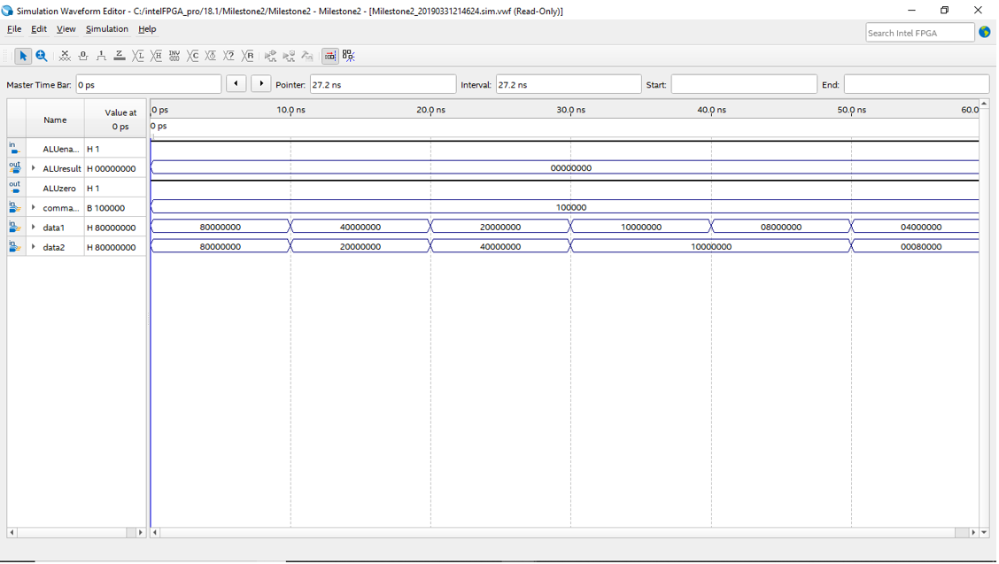

 # Simulation-of-RISC-CPU-using-Verilog-Hardware-Design

### Table of Contents

- [Description](#description)
- [Description of Modules](#description-of-modules)
- [New Instruction “AND”](#new-instruction-and)

---

## Description

This project uses the Quartus Prime software to analyzes a computer processor given to us that takes in a 32 bit string and translates the string to RISC-V instructions. It then executes what the instructions does and updates it. We wrote a detailed description for each component of the processor and created diagrams that display each component’s input and output. We were then required to implement an additional RISC instruction ourselves which was the AND instruction. Once the new instruction was implemented, we created a simulation waveform to showcase its functionality using the software provided.

## Technologies

- RISC - V
- Verilog
- Quartus Prime Software

[Back To The Top](#simulation-of-risc-cpu-using-verilog-hardware-design)

---

## Description of Modules

### Program Counter

The program counter holds the address of the instructions and passes down each instruction individually to the instruction memory. The instructions are then fetched from the instruction memory using the address. After passing it down, it increases the address by 1, basically moving on to the next instruction address. There are some cases where we have either a branch or jump instruction. In this case, the program counter takes the branch or jump instruction address from the decoder and the ALU sends a signal, allowing both the branch and jump instructions to execute. Overall the address increases by an increment of one unless there is a branch or jump instruction, the ALU signals either instruction is executed.

### CPU_top

The combination of all the modules, connecting all the individual modules together to function together as a unit.

### Instruction Memory

The instruction memory uses the address received from the PC and then fetches the instruction. The instruction is then sent to the decoder to be decoded. If the instructions are received, the load instruction command gets the instruction indexed by the address from PC.
 

### Decoder

The decoder take the information and translates it to a lower level language. If there is an immediate type instruction, the immediate value is then decoded. The decoders also decodes registers and operation codes so the ALU knows what operation to execute at that specific instance.

### ALU

The arithmetic logic unit handles all the arithmetic operations and logic operations that occur in the processor. The specific operations that processor uses are adding, subtracting, shifting left which is the same as multiplication and inverting the bits. The data taken from the input is sent to the ALU from the data memory or the decoder depending on the input and the ALU executes the instruction required to complete the task.
 

### Register

The register is taken from the decoder and they are put in the register memory. Registers contain stored memory that can be manipulated to complete various tasks needed. There are specifically 32 registers that each have their own memory space. Each space in the registers contain a value that can be used by the ALU.

### Data Ram

This is where the data is saved to the ram.

### Control

The control module gives all the other modules access to each other in order to complete various tasks required. For example, the registers need access to the ALU modules. The control module gives the registers access to the ALU.

[Back To The Top](#simulation-of-risc-cpu-using-verilog-hardware-design)

---

## New Instruction “AND”

The instruction we decided to implement was the AND instruction. We changed the CPU_top.v module by changing the execution wire from [10:0] (11bits) to [11:0] (12 bits). This was done because we added one more instruction, the AND instruction. We also changed the wire ALUcommand from [4:0] (5 bits) to [5:0] (6 bits) to add one more command to ALU which is ALUAND.

Then we changed inst_decoder.v module. There were originally 11 parameters so we decided to add the AND instruction to have 12 parameters in total and the 12th parameter was AND=12'b100000000000; . We changed execution and the execution_r to 12 bits to open enough space for 12th instruction. We also added the AND instruction into R-type instructions as follows:

      if ((inst[14:12]==3'b111)&&(inst[31:25]==7'b0000000))
         begin
                       execution_r<=AND;
                       rr1_r<=inst[19:15];
                       rr2_r<=inst[24:20]; 
                       wr_r<=inst[11:7];
         end

The next module we changed was the ALU.v module. We changed the command input from 5 bits to 6 bits and added the AND parameter as AND=6'b100000. We also added AND command to execute and instructions as
AND:

         begin
                  ALUresult_r<=data1&data2;
         end

Another module we changed was the control.v module. We changed the input execution from 11 bits to 12 bits and output ALUcommand from 5 bits to 6 bits. There was originally 5 ALU parameters. We increased their bit count by one and added the parameter ALUAND as  parameter ALUAND=6'b100000; We also added parameter AND as  AND=12'b100000000000; increasing the instruction number from 11 to 12 just as it was shown in the inst_decoder. We added the AND instruction to the control stage in control module:    

         begin
                         ALUsrc<=1'b0; 		         //select the rd2.
                         ALUcommand_r<=ALUAND;           //execute bitwise or
                         state<=executing;		 //state to executing stage when next clock comes
         end

After we then added the AND instruction to the execution stage in the control module LW, SLLI, SW, BEQ, ADD, SUB, SLL, XOR, OR, AND shown here: op_reg<=9'b001000000;
We also added the AND instruction to the write back stage along with the other parameters: 

        begin
     	       select_wd<=3'b010; 
        End

We also added the AND instruction to the change_pc stage LW, SLLI, ADD, SUB, SLL, XOR, OR, AND, JAL:op_reg[4]<=1'b1; to print the result to the register file.

### Functionality of The New Instruction AND

[Back To The top](#simulation-of-risc-cpu-using-verilog-hardware-design)

---

